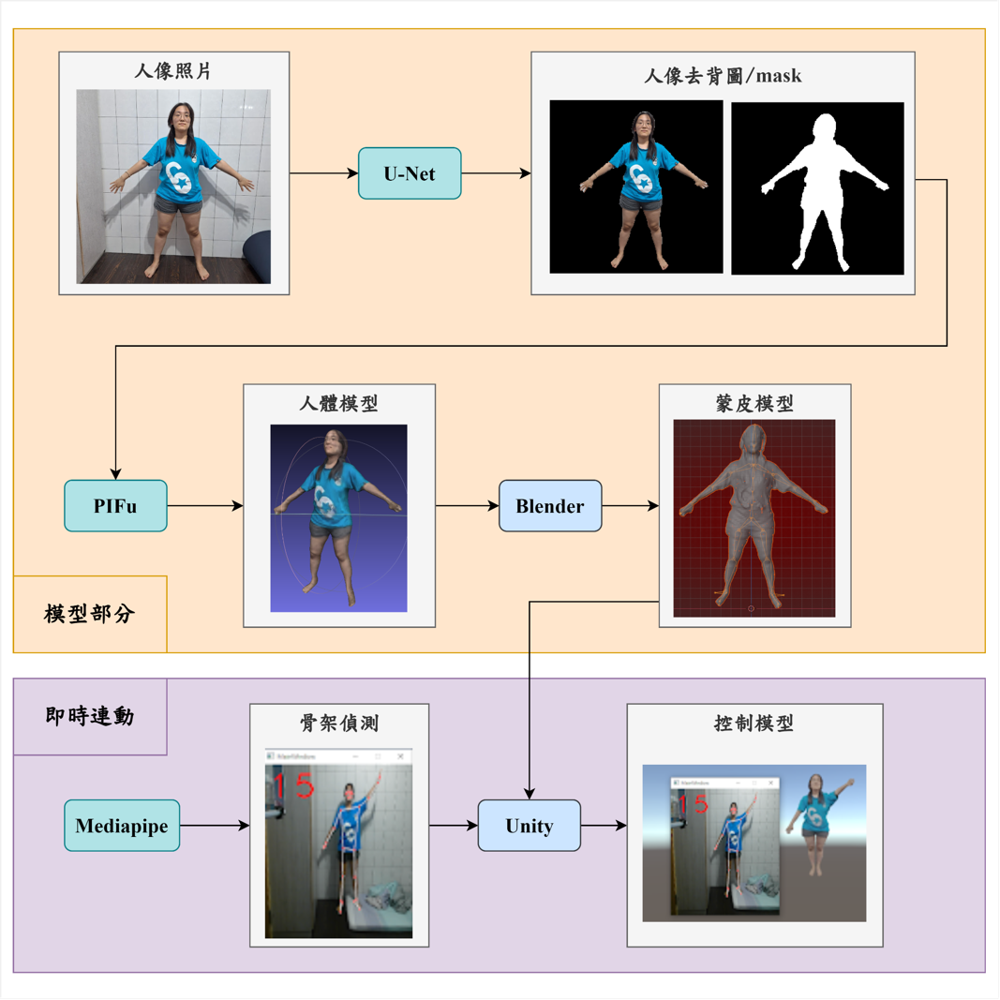

# Combining Deep Learning and 3D Computer Vision Technology for Digital Twin Design

## 介紹
本系統分成兩部分
- GetModel為從一張圖至獲得蒙皮好模型
- pose_track為骨架偵測

## 系統架構圖

## 注意
- GetModel需用到Blender，請先下載好，並將載好的整包資料夾放入BlenderBone下
- 獲得去背圖已訓練好的.h5檔由此[點擊下載](https://drive.google.com/file/d/16CGNquXQ2wyKY8c3fHZ0JmfTR6mLCloe/view?usp=sharing)，並放入GetModel下
- 開啟Unity按鈕，請先將Unity下載好，並把資料放置pose_track下

## 使用方法
1. 建置環境
   - GetModel部分所需環境請參考[model_requirements.txt](https://github.com/pear651530/Combining-Deep-Learning-and-3D-Computer-Vision-Technology-for-Digital-Twin-Design/blob/main/model_requirements.txt)
   - pose_track部分環境建置請參考[環境建置.txt](https://github.com/pear651530/Combining-Deep-Learning-and-3D-Computer-Vision-Technology-for-Digital-Twin-Design/blob/main/%E7%92%B0%E5%A2%83%E5%BB%BA%E7%BD%AE.txt)
2. 執行model_ui.py
3. 執行run.py，按步驟執行即可完成即時模型連動操作

## 成果範例
參考[影片](https://youtu.be/gRvDpN38DEM)

## 參考
- [JizhiziLi. P3M-10k. (2016)](https://github.com/JizhiziLi/P3M).
- [Shunsuke Saito. PIFu. (2019)](https://github.com/shunsukesaito/PIFu).
- [Stereoarts. SAFullBodyIK. (2016)](https://github.com/Stereoarts/SAFullBodyIK).
